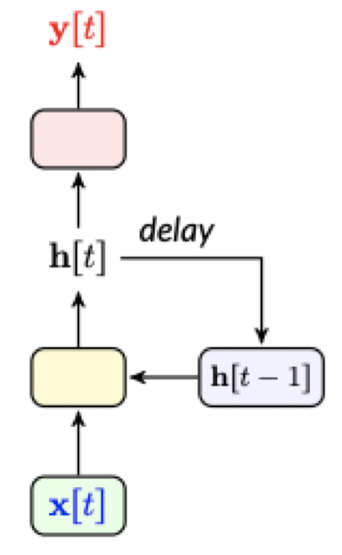
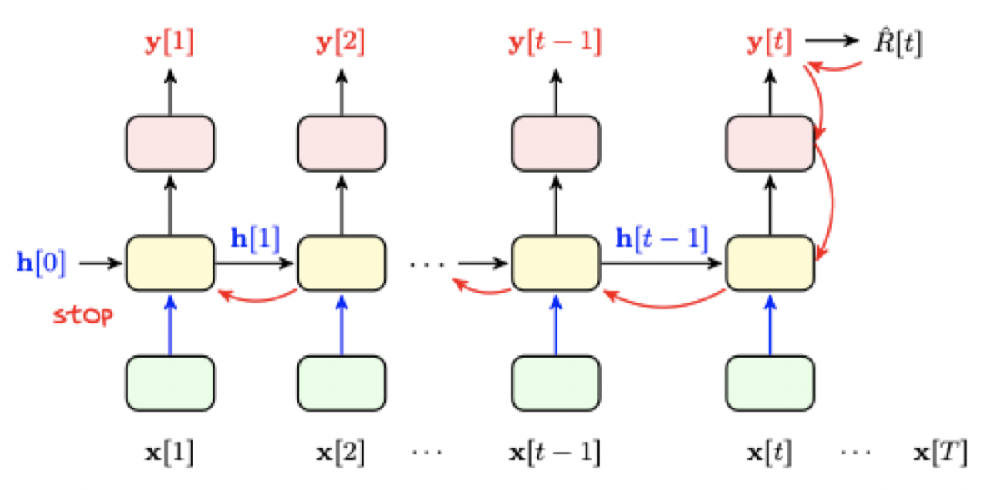
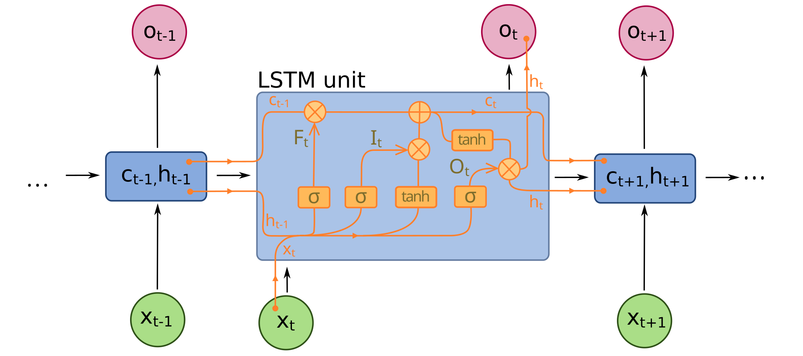
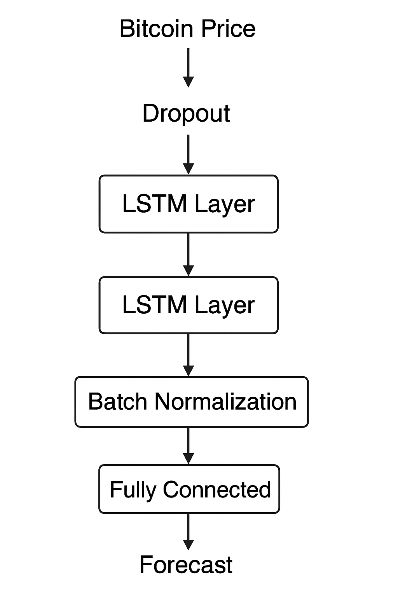
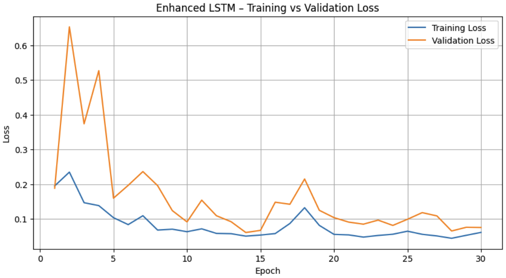
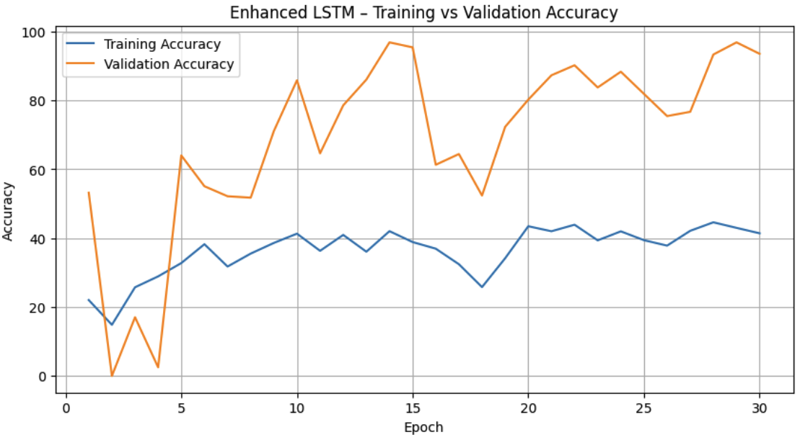

# ECE1508 Final Project - Coinsight
Coinsight is a deep learning based system for forecasting next-day cryptocurrency prices using only historical market data. The project addresses the inherent volatility and nonlinear dynamics of cryptocurrency markets by applying Recurrent Neural Networks (RNNs) sequence models to a sequence-to-one regression task. Given a fixed window of historical features, the model predicts the next-day closing price with a target relative error of 20% or better (currently we're using 10% which is twice as better as our initial proposal).

The system processes historical open, high, low, close prices, volume, returns, and related engineered features collected from the Bitcoin price dataset (sourced from Kaggle)[1]. After resampling, normalization, and feature preparation, the data is fed into two alternative architectures:

1. Baseline Model: **Elman RNN**

    A classical recurrent architecture that captures short-range temporal dependencies, serving as a benchmark for evaluating the effectiveness of our more deeper, enhanced sequence model.

2. Enhanced Model: **Stacked LSTM Network**

    A multi-layer LSTM with dropout between recurrent and fully connected layers. This architecture is designed to capture long-range temporal structure, stabilize training, and reduce overfitting which will be beneficial for financial time-series forecasting.

### Dependencies and Environment Setup
First, to run locally, you will need to clone the GitHub repository. This project requires Python 3.10+ and a small set of deep learning libraries (e.g., NumPy, Pandas, Scikit-learn, PyTorch, Matplotlib). To ensure reproducibility across systems, we provide a requirements.txt file. You may set up the environment using either pip. 

#### Steps:
#### 1. Clone the Repository with Git LFS Support

Since the dataset files are stored using Git Large File Storage (LFS), you need to install Git LFS before pulling the repo.

Install Git LFS

macOS (Homebrew):
```
brew install git-lfs
git lfs install
```

Ubuntu/Debian:
```
sudo apt update
sudo apt install git-lfs
git lfs install
```

Windows:

i. Download and run the Git LFS installer from https://git-lfs.github.com/

ii. Run:
```
git lfs install
```

Clone the repository and pull LFS files
```
git clone https://github.com/kris20012/crypto-price-prediction-rnn.git
cd crypto-price-prediction-rnn
git lfs pull
```

#### 2. Create and activate a virtual environment

a. For MacOS/Linux, first run:
```
python3 -m venv myenv
```

Then, run:
```
source myenv/bin/activate
```

b. For Windows/PowerShell, first run:
```
python -m venv myenv
```

Next, run:
```
myenv\Scripts\Activate
```

#### 3. Now, `cd` into the project repository and install the necessary dependencies. 
    
a. Run the following to update the pip package installer to latest version:
```
pip install --upgrade pip
```

b. Next, we can install the dependencies:
```
pip install -r requirements.txt
```

c. This installation can be verified using:
```
python -c "import torch, numpy, pandas; print('Environment is Correct & Ready!')"
```

#### 4. Finally, you can run each cell using an IDE like VSCode or launch the notebook using the following command:
```
jupyter notebook ECE1508_Final_Project.ipynb
```

### Problem Formulation

Historical Market Data: OHLC (open, high, low, close) prices, and Volume [1] from Kaggle.

Let 
<p align="center">
  
</p>
denote a historical sequence of market data over a window of length $T$.

Our goal is to train a supervised model $f_\theta$ such that
<p align="center">
  
</p>
where <p align="center">
  
</p> is the predicted next-day closing price. The target performance requirement is
<p align="center">
  
</p>

This is a sequence-to-one regression task and is well-suited for recurrent neural architectures.


### Model Architecture Design

A **Recurrent Neural Network (RNN)** is a class of neural networks designed for processing *sequential data*. Unlike feed-forward networks, RNNs incorporate recurrent connections that allow information to persist across time steps. Given an input sequence $(x_1, x_2, \dots, x_T)$, the RNN updates its hidden state according to:

<p align="center">
  
</p>

where $h_t$ represents the hidden state at time $t$, and $f$ is typically a non-linear activation function. This structure enables RNNs to capture temporal dependencies and patterns in time series or language data.

<div align="center">
  <table>
    <tr>
      <td align="center">
        <br>
        <em>(a) Single Elman RNN Unit</em>
      </td>
      <td align="center">
        <br>
        <em>(b) Elman Network</em>
      </td>
    </tr>
  </table>
  <br>
  <em>Figure 1: Elman Recurrent Neural Network Model Design</em>
</div>

<br>

**Long Short-Term Memory (LSTM)** networks are a specialized type of Recurrent Neural Network (RNN) designed to overcome the vanishing and exploding gradient problems that affect standard RNNs. LSTMs introduce an internal memory cell $c_t$ and three gates that regulate how information flows through the network over time: the *forget gate*, *input gate*, and *output gate*. These gates allow the network to retain or discard information dynamically, making LSTMs particularly 
effective for capturing long-range dependencies in sequential data.

The LSTM update equations are:

<p align="center">
  
</p>

<p align="center">
  
</p>

<p align="center">
  
</p>

By explicitly controlling memory retention and forgetting, LSTMs are well-suited for capturing long-term dependencies in financial time-series, and other sequential tasks.

<p align="center">
  
  <br><em>Figure 2: Single LSTM Cell Architecture</em>
</p>

#### Enhanced Stacked LSTM Network Architecture

The model begins with a dropout layer for preventing potential overfitting, which is followed by two stacked LSTM layers, enabling the network to learn from previous price sequences more efficiently. A batch normalization layer is added after the LSTM layers to stabilize training via normalizing intermediate activations. Besides, tanh will be applied as the activation function for
LSTM layers, aiming to prevent vanishing gradients. Compared to the baseline model, this architecture balances temporal modeling strength with overfitting-prevention and stabilization mechanisms, theoretically enhancing its capability to provide forecasts in time-series financial data.

<p align="center">
  
  <br><em>Figure 3: Enhanced Model Architecture</em>
</p>

### Methodology

#### Data Preprocessing Pipeline
Raw OHVLC data are loaded using *pandas* and *NumPy*, along with derived return values. The dataset is then resampled to a daily frequency using standard financial aggregation rules [2]. Any temporal gaps are resolved by re-indexing against a complete daily date range, applying linear interpolation followed by forward-filling to ensure continuity in the price and volume. 

Feature engineering expands the predictive input space by computing daily returns, short- and long-horizon moving averages over 7 and 30 days, rolling volatility over 7 and 30 days, cumulative returns, relative strength index (RSI) over 10-day periods, moving average convergence divergence (MACD) over 10-day and 30-day periods, 20-day Bollinger Bands, On-Balance Volume (OBV), 10-day close--volume correlation, ATR(14), 30-day Fibonacci levels, Williams \%R over 14-day periods, Chaikin Money Flow (CMF) over 20 day periods, normalized volume, and cyclical encoding for day-of-week and day-of-month [3][5]. Rows containing any remaining missing values are removed. All numerical features are standardized using z-score scaling, with scaling parameters fitted strictly on the training partition to prevent data leakage [4]. 

Time-series samples are then created through sliding windows of length $T = 30$, where each window includes features from $t-T+1$ through $t$, and the corresponding label is the close price at $t+1$. The resulting windowed dataset is partitioned chronologically into training, validation, and test sets with an (80-10-10)\% split and no shuffling. Finally, the data are converted into PyTorch tensors, wrapped in TensorDataset objects, and served through DataLoader instances (*batch\_size = 32, shuffle = False*).

#### Training, Evaluation Procedure and Hyperparameter Tuning

Training was performed using PyTorch with device-aware acceleration. The optimization objective is (*nn.L1Loss*) which is MAE, and parameters are updated using the Adam optimizer with a default learning rate of 0.001, while weight decay is exposed as a tunable hyperparameter. Each epoch executes standard backpropagation-through-time (BPTT) over mini-batched sequence windows. 

For each batch, inputs and targets are transferred to the device, gradients are zeroed via *optimizer.zero\_grad()*, a forward pass computes *model(batchX)*, the loss is calculated against *batchY*, *loss.backward()* performs BPTT, and *optimizer.step()* updates the weights. Training loss and an accuracy metric based on a relative error tolerance of 0.1 are accumulated per epoch. Validation is performed each epoch under *model.eval()* and *torch.no\_grad()* by iterating over the validation DataLoader and computing validation loss and accuracy without gradient updates. 

The training history is recorded and plotted. Hyperparameter tuning is automated via a grid search over several hidden sizes, dropout rates, and weight decays, while keeping the learning rate at 0.001 and number of epochs at 30. Each configuration trains an Enhanced LSTM instance, and the model with the lowest validation loss is selected.

### Results

#### Training and Hyperparameter Tuning

During training, the following parameters were recorded for each epoch: *Training Loss, Validation Loss, Training Accuracy, and Validation Accuracy.* The model performance was tuned via a grid search over a predefined hyperparameter space, evaluating each combination of selected values. The following ranges were explored:

<p align="center"><strong>Hyperparameter Search Space</strong></p>

<table align="center">
  <tr>
    <td valign="top">
      <ul>
        <li><strong>Hidden size:</strong> [64, 128]</li>
        <li><strong>Dropout:</strong> [0.0, 0.1, 0.2, 0.3]</li>
      </ul>
    </td>
    <td valign="top">
      <ul>
        <li><strong>Weight decay:</strong> [0.0001, 0.001, 0.01]</li>
        <li><strong>Learning rate:</strong> [0.001, 0.0001]</li>
      </ul>
    </td>
  </tr>
</table>


After tuning, our model produced hyperparameters: **Learning Rate = 0.001, Weight Decay = 0.0001, Dropout = 0.1, Hidden Size = 64.**

#### Performance Results

<div align="center">

| Architecture   | Validation MAE | Test MAE | Test Accuracy |
| -------------- | -------------: | -------: | ------------: |
| Elman          | 0.0886         | 0.4151   | 61.49%       |
| Enhanced LSTM  | 0.0736         | 0.3618   | 67.70%       |
| Enhanced LSTM* | 0.0884         | 0.2966   | 68.53%       |

<sup>*after hyperparameter tuning</sup>
<p align="center"><em>Table 1: Model Performance Comparison Across Architectures</em></p>

</div>

<p align="center">
  <br>
  <em>(a) LSTM Training vs Validation Loss</em>
</p>

<p align="center">
  <br>
  <em>(b) LSTM Training vs Validation Accuracy</em>
</p>

<p align="center">
  <em>Figure 4: Training and Validation Performance Curves for the Enhanced LSTM Model</em>
</p>

### Conclusion

This project evaluated deep learning models for cryptocurrency time-series forecasting by first using an Elman RNN as a baseline and then enhancing the architecture with LSTM units. This progression enables a direct comparison between simple recurrent dynamics and gated temporal modeling for the highly volatile cryptocurrency market.

The Elman RNN exhibited stable training behavior and acceptable short-horizon accuracy but struggled to capture long-term dependencies, resulting in higher validation error and weaker directional performance. The LSTM model consistently improved accuracy relative to the Elman RNN. Its gating mechanism allows selective retention of historical information, leading to better generalization and smoother predictions. 

Validation performance was at times comparable to or better than training performance, reflecting regularization effects rather than overfitting. Despite improved point-wise accuracy, directional accuracy remained only slightly above random chance. This emphasizes that minimizing numerical prediction error does not directly translate into reliable trading signals, particularly in highly volatile and non-stationary cryptocurrency markets.

Future improvements could include incorporating additional information sources such as market sentiment, order book data, or macroeconomic indicators, as well as exploring more advanced sequence models such as attention-based architectures or Transformers. Reformulating the task as a probabilistic or classification problem may also lead to more actionable predictions.

### References

[1] Zielak, “Bitcoin historical data,” Kaggle, https://www.kaggle.com/datasets/mczielinski/bitcoin-historical-data/versions/422?resource=download

[2] Pandas resample with resample() and asfreq() | datacamp, https://www.datacamp.com/tutorial/pandas-resample-asfreq

[3] Creating a technical indicator based strategy: Xgboost | by David Borst | Sep, 2025 | medium, https://datadave1.medium.com/creating-a-technical-indicator-based-strategy-xgboost-b6fd5a79e705

[4] S. Shrivastava, “Data cleaning using pandas: A comprehensive guide,” DEV Community, https://dev.to/samagra07/data-cleaning-using-pandas-a-comprehensive-guide-2kb0

[5] Candlestick, RSI, Bollinger Bands, and MACD with python | by Armando Aguilar L. | Medium, https://medium.com/@armand_aguilar/candlestick-rsi-bollinger-bands-and-macd-with-python-ba7ddaef0525